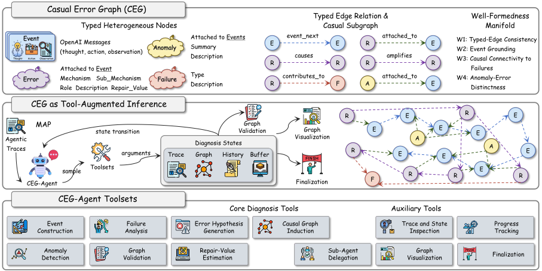
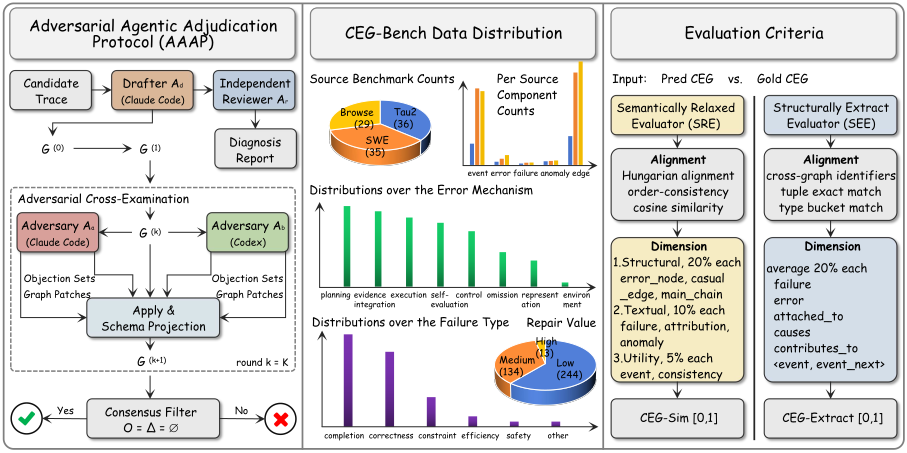

<div align="center">

# CEG-Agent

### From Anomalies to Failures: Constructing Causal Error Graphs for Agentic Trace Diagnosis

</div>

#### CEG-Agent:


#### CEG-Bench:



This repository contains the diagnostic agent (`agent/`), the benchmark (`CEG-Bench/`), and both evaluators (`evaluator/`) needed to reproduce the headline experiments.

## What it does

Given an OpenAI-style agentic execution trace, CEG-Agent constructs a typed **Causal Error Graph (CEG)** that separates:

- **events** — thought/action/observation execution units;
- **failures** — outcome-level task breakdowns (6 types);
- **errors** — process-level deviations that causally contribute to a failure, each tagged with one of 8 mechanisms and one of 3 structural roles (root / propagated / amplification);
- **anomalies** — surface irregularities surfaced for diagnostic completeness but excluded from causal attribution.

Construction is iterative and validator-guided: a top-level LLM policy invokes several tools (event construction, failure analysis, error hypothesis generation, causal graph induction, anomaly detection, validation, repair-value estimation, plus inspection / tracking / sub-agent / visualization / finalization auxiliaries) and a deterministic schema projection `Π` guarantees the released graph is always well-formed.

## Repository layout

```
CEG-Agent/
├── agent/                       # CEG-Agent framework
│   ├── main.py                  # CLI entry: single-trace / batch
│   ├── config.py                # Env-var-driven configuration
│   ├── schemas/graph.py         # Pydantic CEG schema + legal edge endpoints
│   ├── pipeline/                # Linear + agentic orchestrators
│   ├── agent_loop/              # Tool-use loop, sub-agent dispatch, todo list
│   ├── agents/                  # Per-phase agents (events / failures / errors / ...)
│   ├── tools/                   # Tool registry exposed to the top-level LLM
│   ├── critic/                  # Deterministic validators + auto-repair rules
│   ├── prompts/                 # Per-phase system prompts
│   ├── llm/                     # OpenAI-compatible + mock backends
│   ├── viz/                     # DOT / HTML / SVG renderers
├── evaluator/
│   ├── sre.py                   # Semantically Relaxed Evaluator (CEG-Sim)
│   ├── see.py                   # Structurally Exact Evaluator (CEG-Exact)
│   └── scorer.py                # SEE per-dimension scoring
└── CEG-Bench/
    ├── input/                   # 100 raw agentic traces (OpenAI format)
    ├── process/                 # Same traces with deterministic event scaffold
    │                            #   (events + event_next edges); used as the
    │                            #   "+Process" baseline input
    └── final/                   # 100 consensus CEG annotations (gold)
```

## Installation

Python 3.10+ is required.

```bash
# Core
pip install pydantic openai

# Evaluator
pip install scipy numpy                    # Hungarian alignment (SRE)
pip install torch transformers              # BGE-M3 text similarity (SRE)

# Optional: SVG rendering for the bundle viewer
sudo apt-get install graphviz               # provides `dot` binary
```


## CEG-Bench

100 failed GLM-4.6 traces drawn from three real-world agentic benchmarks (BrowseComp, Tau2Bench, SWE-bench) from [TraceSIR](https://github.com/SHU-XUN/TraceSIR), annotated through an Adversarial Agentic Adjudication Protocol and retained only when two heterogeneous adversarial annotators converge to zero objections. Per-trace files are named by `oid` (e.g. `1016.json`, `tau2-...json`, `astropy__astropy-13033.json`).

Per-source counts in the released set: **29** BrowseComp / **36** Tau2Bench / **35** SWE-bench. Aggregate annotations: 3,488 events, 391 errors, 125 failures, 253 anomalies, 4,540 typed edges (749 causal).

`CEG-Bench/input/` holds the raw input traces; `CEG-Bench/final/` holds the gold CEGs scored against by the evaluators. `CEG-Bench/process/` is the deterministic event-scaffold version used as input to the **+Process** baseline.

## Quick start

End-to-end on one trace, mock backend (no API key needed):

```bash
python -m agent.examples.run_demo
```

Real backend on a single CEG-Bench trace, writing a per-trace output bundle:

```bash
export CE_LLM_BACKEND=openai
export CE_LLM_MODEL=gpt-5
export CE_LLM_API_KEY=sk-...

python -m agent.main \
    --mode agentic \
    --input CEG-Bench/input/1016.json \
    --output-dir runs/demo
```

The bundle at `runs/demo/1016/` contains `diagnosis.json` (final CEG), `agentic_steps.jsonl` (per-iteration tool calls), `tool_trace.jsonl` (per-call tokens + latency), `summary.json`, `run.log`, and `graph.{dot,html,svg}`.

## Running CEG-Agent

### Single trace

```bash
python -m agent.main --mode agentic \
    -i CEG-Bench/input/<oid>.json \
    -O runs/my_run
```

### Batch

```bash
python -m agent.main --mode agentic \
    -I CEG-Bench/input/ \
    -O runs/my_run

# Resume after interruption (skips traces with valid diagnosis.json)
python -m agent.main --mode agentic -I CEG-Bench/input/ -O runs/my_run --resume

# Only retry traces that failed in a prior batch
python -m agent.main --mode agentic -I CEG-Bench/input/ -O runs/my_run --retry-failed
```

A `runs/my_run/index.json` is written summarizing wall-clock and token totals per trace.

### Configuration (environment variables)

| Variable               | Default          | Description |
|------------------------|------------------|-------------|
| `CE_LLM_BACKEND`       | `mock`           | `mock` / `openai` / `azure` / `openai-compatible` |
| `CE_LLM_MODEL`         | `gpt-4o-mini`    | Model ID passed to the provider |
| `CE_LLM_API_KEY`       | —                | Provider API key |
| `CE_LLM_BASE_URL`      | —                | Override base URL (vLLM, Azure, OpenRouter, ...) |
| `CE_LLM_TEMPERATURE`   | `1.0`            | Sampling temperature; paper experiments use `1` |
| `CE_LLM_MAX_TOKENS`    | `-1` (provider default) | Hard output cap |
| `CE_MAX_RETRIES`       | `2`              | LLM call retries on transient errors |
| `CE_CRITIC_ROUNDS`     | `2`              | LLM-critic rounds; paper experiments use `2` |
| `CE_ENABLE_REPAIR`     | `1`              | Enable `estimate_repair_values` tool |
| `CE_TRACE_MAX_CHARS`   | `800000`         | Hard ceiling on rendered trace size sent to the LLM |
| `CE_OBS_CLIP_THRESHOLD`| `1500`           | Observations longer than this are head/tail clipped in prompts |
| `CE_OBS_CLIP_KEEP`     | `600`            | Chars kept at each end when clipping |
| `CE_KEEP_TAIL_EVENTS`  | `1`              | Number of trailing events shipped verbatim (never clipped) |
| `CE_LOG_LEVEL`         | `INFO`           | Logger verbosity |

Agent-loop budget is controlled at the CLI via `--max-iters` (default `24`, matching paper `K=24`).

### Output bundle

Per trace the orchestrator emits:

| File | Contents |
|---|---|
| `diagnosis.json`     | Final CEG in the released schema (events / errors / failures / edges / anomaly) |
| `agentic_steps.jsonl`| One record per agent iteration: assistant text + invoked tool calls + elapsed |
| `tool_trace.jsonl`   | One record per LLM call: phase label, token usage, wall-clock |
| `summary.json`       | Counts, totals, elapsed, backend metadata, trace truncation flag |
| `run.log`            | Console pretty-render (ANSI stripped) + full logger output |
| `graph.dot`          | Graphviz source |
| `graph.html`         | Self-contained interactive viewer (vis-network from CDN) |
| `graph.svg`          | Static SVG (only if the `dot` binary is on PATH) |

## Evaluation

Predicted CEGs are scored against `CEG-Bench/final/` under two complementary criteria.

### Semantically Relaxed Evaluator (SRE → CEG-Sim)

Hungarian bipartite node alignment with type-specific similarity (event grounding, categorical agreement on mechanism / role / failure type, BGE-M3 text similarity over free-text fields). Reports F1 over 8 dimensions; composite is a tier-weighted aggregate (20% × 3 structural + 10% × 3 textual + 5% × 2 utility).

```bash
export CEG_EMBED_MODEL=BAAI/bge-m3

python -m evaluator.sre \
    --gold_dir CEG-Bench/final/ \
    --pred_dir runs/my_run/ \
    --file_name diagnosis.json \
    --output runs/my_run/sre_report.json
```

Defaults match the paper's evaluation thresholds (all four set to `0.60`); override via `--event_threshold` / `--error_threshold` / `--failure_threshold` / `--anomaly_threshold`.

### Structurally Exact Evaluator (SEE → CEG-Exact)

Rule-based, LLM-free. Errors are matched by exact `(event_id, mechanism)` tuple, failures by bucketed type. Composite is the unweighted mean of `{failure, error, attached_to, causes, contributes_to}`.

```bash
python -m evaluator.see batch \
    --gold-dir CEG-Bench/final/ \
    --pred-dir runs/my_run/ \
    --out-dir runs/my_run/see_reports/
```

`runs/my_run/see_reports/_summary.json` carries the macro composite and per-dimension breakdown (overall and by complexity tercile).

For a single (gold, pred) pair:

```bash
python -m evaluator.see single \
    --gold CEG-Bench/final/1016.json \
    --pred runs/my_run/1016/diagnosis.json \
    --out  runs/my_run/see_reports/1016.json
```


## Citation

If you use CEG-Agent in your research, please cite:

```bibtex
@misc{yang2026anomaliesfailuresconstructingcausal,
      title={From Anomalies to Failures: Constructing Causal Error Graphs for Agentic Trace Diagnosis}, 
      author={Shu-Xun Yang and Yidong Wang and Zhuoer Feng and Bosi Wen and Jiayi Gui and Dayong Yang and Wenbo Yu and Haoke Zhang and Jie Tang and Cunxiang Wang},
      year={2026},
      eprint={2609.32514},
      archivePrefix={arXiv},
      primaryClass={cs.AI},
      url={https://arxiv.org/abs/2609.32514}, 
}
```

